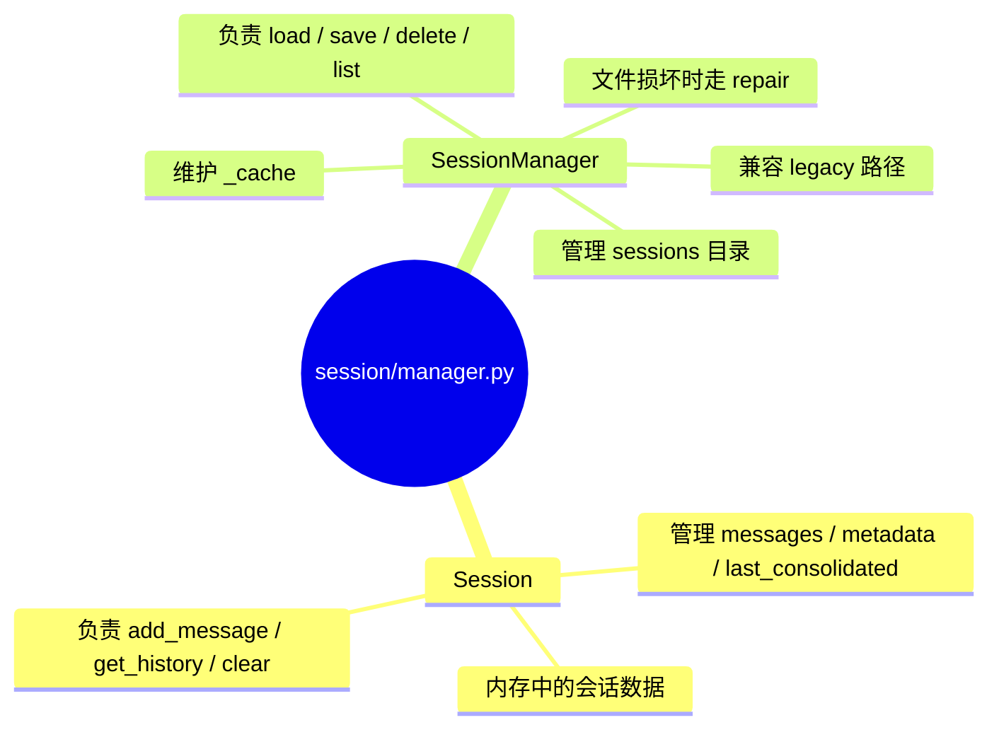
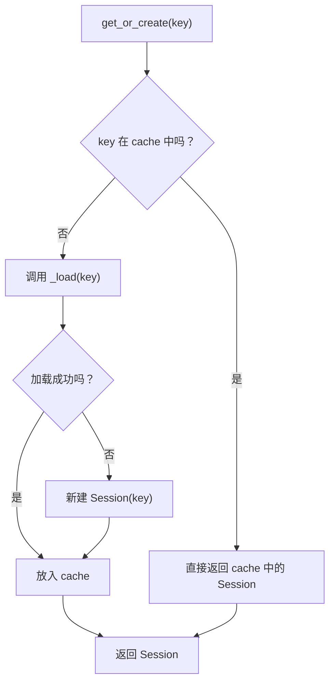
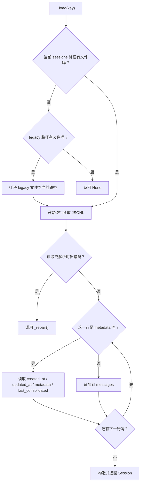
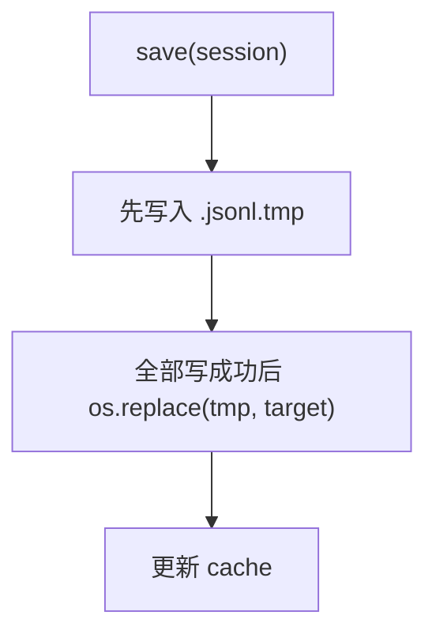
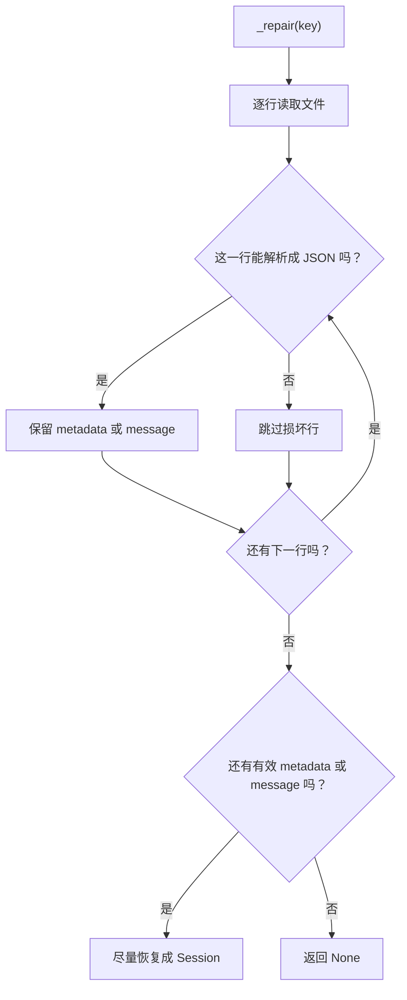

# `session/manager.py` 学习笔记

## 1. 相关 Python 点

### 1.1 为什么 `Session` 用 `dataclass`，`SessionManager` 不用

- `Session` 是数据对象，核心是字段：`key`、`messages`、`metadata`、`last_consolidated`
- `SessionManager` 是服务对象，核心是行为：加载、保存、删除、修复、列举 session

可以粗略类比成：

- `Session` 像 TS 里的数据 model
- `SessionManager` 像 TS 里的 service / repository

### 1.2 `tmp_path`、`monkeypatch` 是谁传进测试函数的

- 它们是 `pytest` fixture
- 不是手动传参
- `pytest` 会根据测试函数的参数名自动注入

例如：

```python
def test_xxx(monkeypatch, tmp_path: Path) -> None:
    ...
```

这里的参数不是你自己传的，而是 `pytest` 帮你准备好的。

### 1.3 fixture 是内置的吗，还是要注册

- `tmp_path`、`monkeypatch` 是 `pytest` 内置 fixture
- 自己定义的 fixture 需要用 `@pytest.fixture`
- 共享 fixture 通常放在 `conftest.py`

### 1.4 `_UNSAFE_CHARS` 这种写在函数外的变量算什么

- 它是模块级变量
- 单下划线 `_` 表示“内部使用的实现细节”
- 不是语法级私有，只是命名约定

这里把正则放在函数外，是为了复用，不必每次调用都重新 `re.compile(...)`。

### 1.5 `shutil` 和 `loguru` 分别是什么

- `shutil`：Python 标准库，做文件复制、移动、删除目录等操作
- `loguru`：第三方日志库，需要安装依赖

在 `manager.py` 里：

- `shutil.move(...)` 用来做 legacy session 迁移
- `logger.info(...)` / `logger.warning(...)` / `logger.exception(...)` 用来记录运行日志

### 1.6 `path.mkdir(parents=True, exist_ok=True)` 是什么意思

- `parents=True`：父目录不存在时一起创建
- `exist_ok=True`：目录已存在时不报错

对应到 `ensure_dir(path)`，含义就是：

> 确保这个目录存在，并把这个 `Path` 返回回来继续使用

---

## 2. 这个模块做什么

`session/manager.py` 负责把“会话的内存表示”和“磁盘上的 session 文件”连接起来。

可以拆成两层：

- `Session`：管理内存中的会话数据
- `SessionManager`：管理 session 的加载、保存、修复、删除、缓存

---

## 3. 路径

### 3.1 当前 session 存储路径

```text
<workspace>/sessions/<safe_key>.jsonl
```

例如：

```text
/my-workspace/sessions/telegram_123456.jsonl
```

### 3.2 legacy 路径

```text
~/.nanobot/sessions/<safe_key>.jsonl
```

如果当前 workspace 里没有该 session，但 legacy 路径里有，`_load()` 会尝试迁移过来。

### 3.3 `safe_key`

`safe_key()` 的作用是把：

```text
telegram:123/456?abc
```

变成适合做文件名的形式，例如：

```text
telegram_123_456_abc
```

这里依赖的是：

- 先把 `:` 替换成 `_`
- 再用 `safe_filename()` 清理非法文件名字符

---

## 4. 协议：session 文件怎么存

这里用的是 JSONL。

### 4.1 什么是 JSONL

JSONL = JSON Lines，特点是：

- 一行一个 JSON 对象
- 适合逐行写入
- 文件局部损坏时更容易修复

### 4.2 当前文件结构

第一行是 metadata：

```json
{
  "_type": "metadata",
  "key": "telegram:abc",
  "created_at": "...",
  "updated_at": "...",
  "metadata": {},
  "last_consolidated": 0
}
```

后面每一行是一条 message：

```json
{"role": "user", "content": "hello"}
{"role": "assistant", "content": "hi"}
```

---

## 5. `Session` 的几个关键概念

### 5.1 `messages`

会话里的消息列表。

常见 `role`：

- `system`
- `user`
- `assistant`
- `tool`

### 5.2 `last_consolidated`

它表示：

> 前面有多少条消息已经被 consolidate 过了

所以：

```python
unconsolidated = self.messages[self.last_consolidated:]
```

意思就是：

> 只取“还没 consolidate 的那段增量消息”

### 5.3 `find_legal_message_start`

它的作用是：

> 避免历史开头出现 orphan tool result

也就是这种非法开头：

```text
tool
assistant
```

但是前面没有对应的：

```text
assistant(tool_calls=[...])
```

---

## 6. 图示

### 6.1 模块分工



### 6.2 `get_or_create()`



### 6.3 `_load()`



### 6.4 `save()`



这个写法的目的就是“原子写入”，避免把正式文件写坏。

### 6.5 `_repair()`



---

## 7. 这一轮学习我觉得最值得记住的点

1. `Session` 是数据模型，`SessionManager` 是持久化服务。
2. session 文件存在 `workspace/sessions/*.jsonl`。
3. JSONL 的第一行是 metadata，后面每一行是一条消息。
4. `last_consolidated` 是“已经 consolidate 到哪一条”的游标。
5. `find_legal_message_start()` 是为了去掉 orphan tool result。
6. `save()` 用原子写入，`_repair()` 用逐行恢复。
