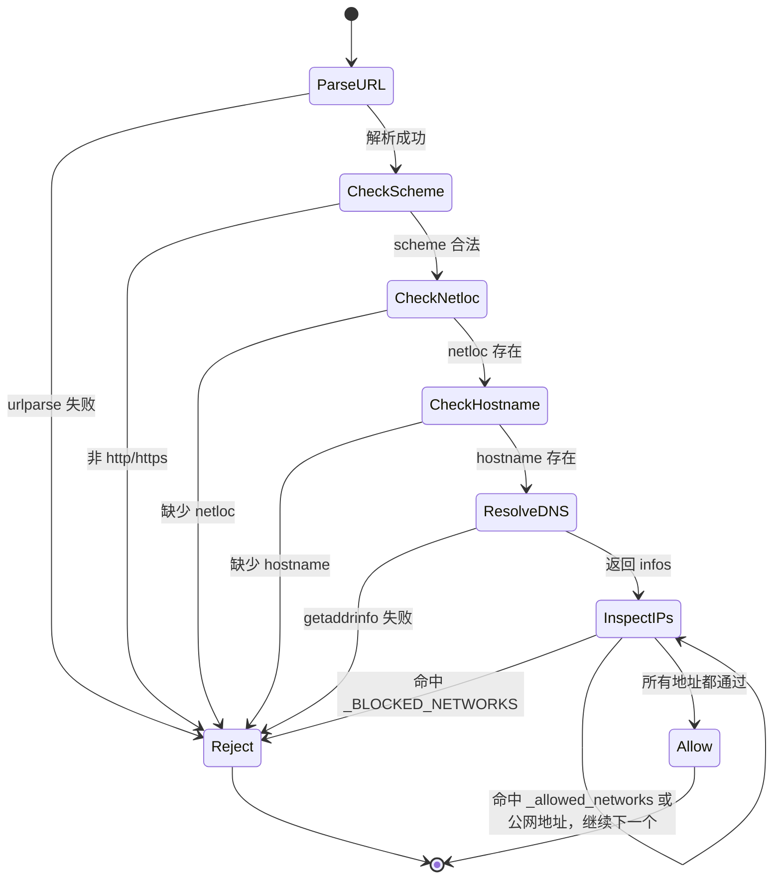
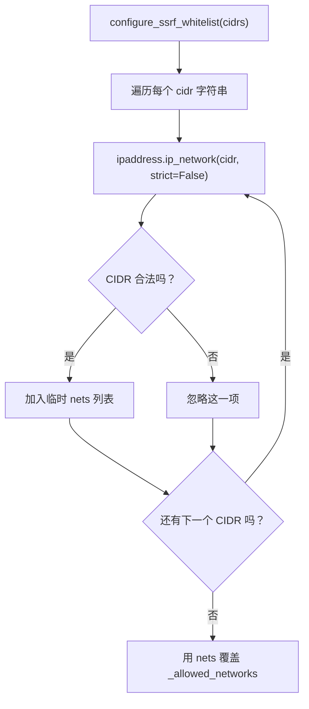

# `security/network.py` 学习笔记

## 1. 相关 Python 点

### 1.1 `urlparse()`、`p.netloc`、`p.hostname` 分别是什么

- `urlparse(url)` 会把 URL 拆成 `scheme`、`netloc`、`path`、`query` 等部分。
- `p.netloc` 是 `//` 后面到 path 前面的那段，类似 TS `new URL(url).host` 对应的原始网络位置。
- `p.hostname` 是从 `netloc` 里进一步解析出的主机名，更适合拿去做 DNS 解析和 IP 安全校验。

### 1.2 `socket.getaddrinfo()` 是干什么的

- 它是 Python 标准库里的地址解析函数，会把域名解析成可连接的地址信息。
- `socket.AF_UNSPEC` 表示 IPv4 / IPv6 都可以。
- `socket.SOCK_STREAM` 表示只取适合 TCP 连接的结果，HTTP / HTTPS 都基于 TCP。

### 1.3 CIDR 是什么

- CIDR 是一种表示 IP 网段的写法，格式是 `IP/前缀长度`。
- 例如 `192.168.1.0/24` 表示一个网段，不是单个 IP。
- 这里白名单配置传入的是一组 CIDR，后面会转成 `ipaddress.ip_network(...)` 来判断某个 IP 是否落在这个网段里。

### 1.4 `from __future__ import annotations` 在这里起什么作用

- 它会延迟类型注解的求值。
- 这种写法对当前文件不是“必须”，但能让复杂类型、前向引用、类型检查行为更稳定。
- 可以类比成“让类型注解更偏静态信息，不急着在运行时立刻解析”。

## 2. 这个模块做什么

- `security/network.py` 负责做网络目标安全校验，核心目的是防 SSRF。
- 它会把 URL 解析成 hostname，再解析成 IP，判断目标是不是内网、本机、link-local、metadata 等敏感地址。
- 它还支持配置 `SSRF whitelist`，允许某些默认拦截的网段按需放行，例如 Tailscale 常用的 `100.64.0.0/10`。

## 3. 路径

### 3.1 当前路径

```text
nanobot_learn/security/network.py
tests/security/test_security_network.py
```

### 3.2 参考的上游路径

```text
nanobot/security/network.py
tests/security/test_security_network.py
```

## 4. 协议 / 输入输出格式

- 这个模块不是存储模块，没有 JSONL / 文件协议。
- 它的核心接口是“输入字符串 URL / CIDR，输出布尔值或 `(ok, error_message)`”。

最小样例：

```python
ok, err = validate_url_target("http://example.com/api")

configure_ssrf_whitelist(["100.64.0.0/10"])
```

## 5. 关键概念

### 5.1 SSRF

- SSRF = Server-Side Request Forgery，意思是攻击者自己不能直接访问某个地址，但可以诱导服务器 / agent 去访问。

### 5.2 `_BLOCKED_NETWORKS`

- 这是默认拦截的内网和敏感网段列表，例如 `127.0.0.0/8`、`10.0.0.0/8`、`192.168.0.0/16`、`169.254.0.0/16`。

### 5.3 `_allowed_networks`

- 这是运行时白名单，来源于 `configure_ssrf_whitelist(...)`。
- 如果某个 IP 命中了 `_allowed_networks`，就不再视为 private / internal。

### 5.4 `validate_url_target()`

- 这是主入口函数。
- 它先校验 scheme / domain，再解析 hostname 对应的 IP，最后判断 IP 是否在危险网段里。

## 6. 图示

### 6.1 `validate_url_target()` 状态流转



### 6.2 `configure_ssrf_whitelist()`



## 7. 这一轮先记住什么

1. 这个模块不是“登录权限”，而是“网络访问目标安全校验”，主要防 SSRF。
2. `validate_url_target()` 的关键步骤是：URL 解析 -> hostname 解析 -> IP 网段判断。
3. `configure_ssrf_whitelist()` 只是对白名单网段做运行时覆盖，不会放开所有 private range。
