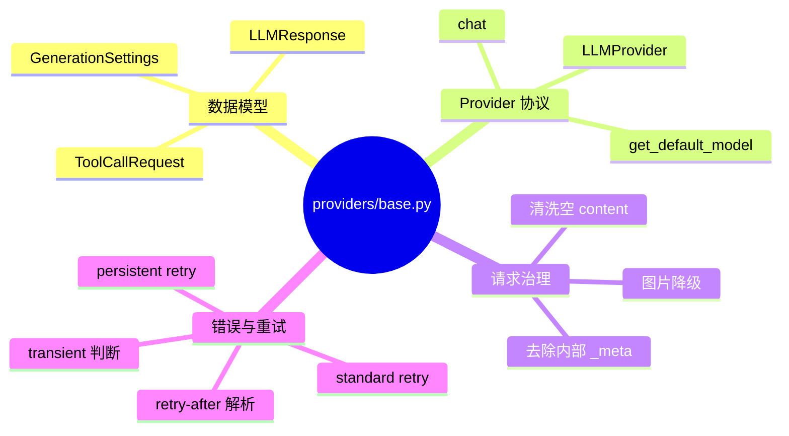
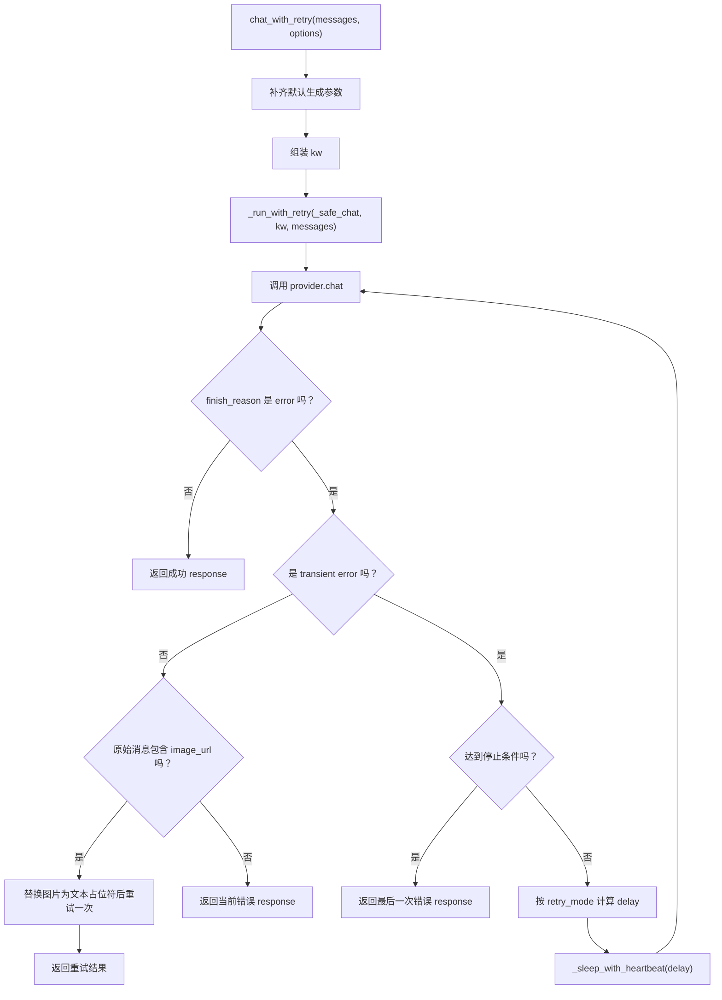
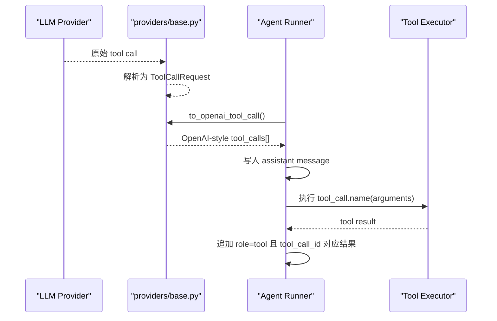
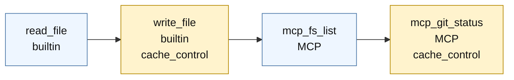
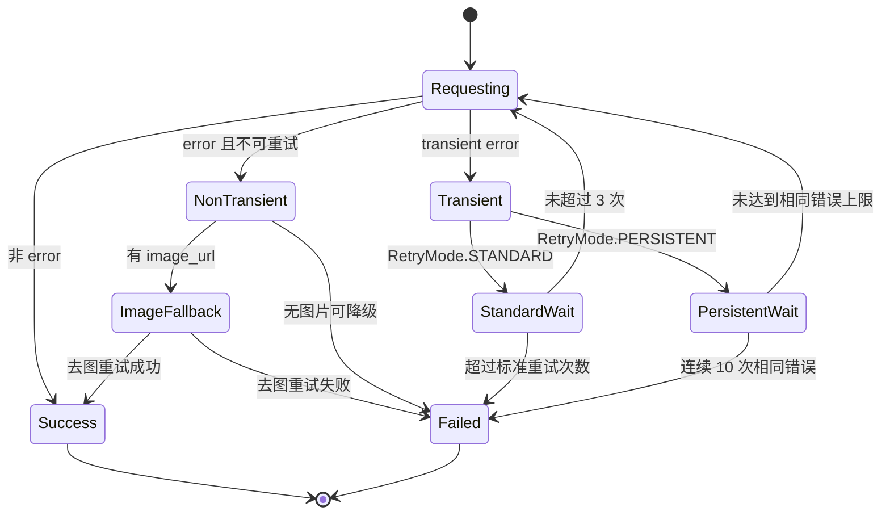

# `providers/base.py` 学习笔记

## 1. 相关 Python 点

### 1.1 `dataclass` 和 `field(default_factory=list)`

- `ToolCallRequest`、`LLMResponse`、`GenerationSettings` 都是数据对象，用 `dataclass` 可以少写 `__init__`。
- `field(default_factory=list)` 用来给每个实例创建独立 list，避免多个实例共享同一个默认 list。

### 1.2 `StrEnum`

- `FinishReason`、`RetryMode` 用 `StrEnum` 定义固定字符串集合。
- 它既能像 enum 一样限制可选值，又能和普通字符串比较，适合 provider 返回的 `"stop"`、`"tool_calls"`、`"error"` 这类协议字段。

### 1.3 `@dataclass(frozen=True)`

- `GenerationSettings` 使用 `frozen=True`，表示实例创建后字段不能被重新赋值。
- 可以类比成 TS 里的 `Readonly<GenerationSettings>`，适合放默认生成参数。

### 1.4 `ABC`、`@abstractmethod`

- `LLMProvider` 是抽象基类，定义所有 provider 子类必须实现的能力。
- `chat()` 和 `get_default_model()` 是抽象方法，子类没有实现时不能实例化。

### 1.5 `async` / `await`

- `chat_with_retry()`、`_run_with_retry()`、`_sleep_with_heartbeat()` 都是异步函数。
- `await` 会暂停当前 coroutine，把执行权交还给事件循环；被等待的任务完成后，再从当前位置继续执行。

### 1.6 `_SENTINEL = object()`

- `_SENTINEL` 是“未传参数”的唯一占位对象。
- 它可以区分“调用方没传”和“调用方显式传了 `None`”，判断时要用 `is`。

## 2. 这个模块做什么

- `providers/base.py` 定义 LLM provider 的统一基础协议。
- 它把不同 provider 的返回结果统一成 `LLMResponse` 和 `ToolCallRequest`。
- 它还提供通用能力：消息清洗、图片降级、transient error 判断、retry-after 解析、标准重试和 persistent retry。



## 3. 路径

### 3.1 当前路径

```text
nanobot_learn/providers/base.py
tests/providers/test_base.py
```

### 3.2 参考的上游路径

```text
/Users/liudong/code/agent/nanobot/nanobot/providers/base.py
/Users/liudong/code/agent/nanobot/tests/providers/
```

## 4. 协议 / 数据格式

### 4.1 OpenAI-style tool call

`ToolCallRequest.to_openai_tool_call()` 会把内部统一对象转成 OpenAI 风格的 `assistant.tool_calls[]` 元素。

```json
{
  "id": "call_1",
  "type": "function",
  "function": {
    "name": "read_file",
    "arguments": "{\"path\": \"a.txt\"}"
  }
}
```

注意：`function.arguments` 是 JSON 字符串，不是 Python dict。

### 4.2 LLMResponse

```python
LLMResponse(
    content=None,
    tool_calls=[ToolCallRequest(id="call_1", name="read_file", arguments={"path": "a.txt"})],
    finish_reason=FinishReason.TOOL_CALLS,
)
```

`should_execute_tools` 只有在有 tool calls 且 `finish_reason` 是 `stop` 或 `tool_calls` 时才为 `True`。

## 5. 关键概念

### 5.1 Tool call 内部统一模型

例子：OpenAI 可能返回 `tool_calls[].function.arguments` 字符串，Anthropic / Gemini 可能有自己的 tool use 结构。解析后统一变成：

```python
ToolCallRequest(
    id="call_1",
    name="read_file",
    arguments={"path": "a.txt"},
)
```

它影响的是 runner 的复杂度。runner 后续只处理 `ToolCallRequest`，不需要在执行工具时再判断“这是 OpenAI 格式还是 Anthropic 格式”。

### 5.2 Provider 扩展字段

例子：Gemini OpenAI-compatible API 可能在 tool call 上带 `extra_content`，里面有 thought signature 这类非标准字段。

```python
ToolCallRequest(
    id="call_1",
    name="read_file",
    arguments={"path": "a.txt"},
    extra_content={"google": {"thought_signature": "sig"}},
    function_provider_specific_fields={"inner": "value"},
)
```

它影响的是 provider round-trip。如果这些字段丢了，下一轮把 history 发回 provider 时，某些 provider 可能无法正确延续上下文或校验 tool call。

### 5.3 Prompt cache marker

例子：tools 正常排序后是 builtin 在前，MCP 在后。

```python
["read_file", "write_file", "mcp_fs_list", "mcp_git_status"]
```

`_tool_cache_marker_indices()` 返回：

```python
[1, 3]
```

它影响的是 prompt caching 的切分点：`write_file` 标记 builtin 工具段结束，`mcp_git_status` 标记完整 tools 列表结束。这样稳定的 builtin 工具和更易变化的 MCP 工具可以分别形成缓存边界。

### 5.4 Transient error

例子：下面这种错误适合等待后重试。

```python
LLMResponse(
    content="429 rate limit, retry after 2s",
    finish_reason=FinishReason.ERROR,
    error_status_code=429,
)
```

但下面这种 429 不应该重试，因为是额度或账单问题。

```python
LLMResponse(
    content="exceeded your current quota",
    finish_reason=FinishReason.ERROR,
    error_status_code=429,
)
```

它影响的是 `_run_with_retry()` 会不会进入等待重试。如果误判 transient，会浪费时间反复请求；如果漏判 transient，会过早放弃本来可以恢复的请求。

### 5.5 Retry mode

例子：同样是 `429 rate limit`，标准模式最多按 `(1, 2, 4)` 秒重试，之后返回最后一次错误。

```python
await provider.chat_with_retry(messages, retry_mode=RetryMode.STANDARD)
```

persistent 模式会继续尝试，但连续 10 次相同错误会停止。

```python
await provider.chat_with_retry(messages, retry_mode=RetryMode.PERSISTENT)
```

它影响的是 agent 在长任务中的韧性。标准模式适合普通请求，persistent 模式适合希望 agent 等待 provider 恢复的长运行场景，但必须有停止保护，避免无限卡死。

## 6. 基本流程图

### 6.1 `chat_with_retry()`



### 6.2 Tool call 转换



### 6.3 Prompt cache marker



### 6.4 Retry mode 状态



## 7. 测试覆盖

- `ToolCallRequest` 的 OpenAI-style 序列化，包括中文参数和 provider 扩展字段。
- `LLMResponse.should_execute_tools` 的执行条件。
- `GenerationSettings` 的 frozen 行为。
- message content 清洗和 tool cache marker 下标计算。
- transient error、429 quota、retry-after 文本解析。
- `chat_with_retry()` 的默认参数、标准重试停止、persistent retry 停止和图片降级重试。

## 8. 这一轮先记住什么

1. `providers/base.py` 是 provider 层的“统一协议层”，不是具体 provider 实现。
2. `ToolCallRequest` 是内部统一模型，`to_openai_tool_call()` 是把它转成 OpenAI message history 能理解的格式。
3. retry 逻辑要区分 transient / non-transient，并且 persistent retry 也必须有停止保护。
