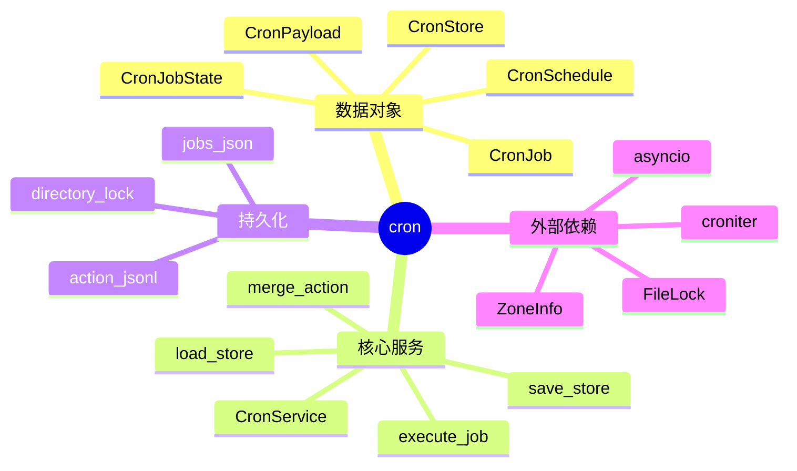
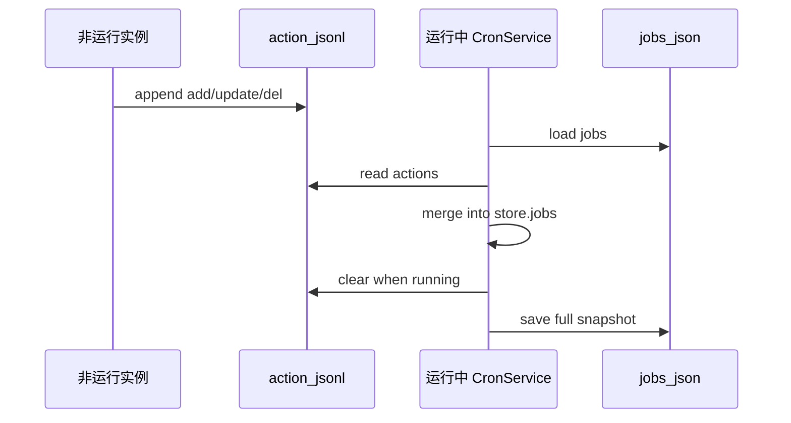
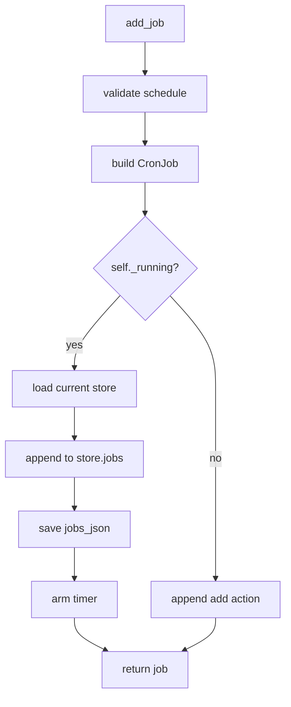
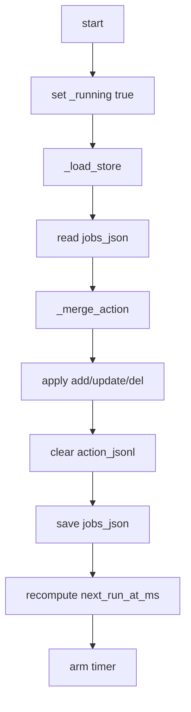
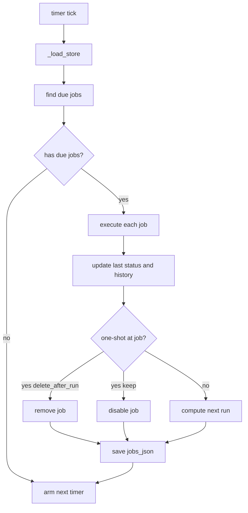
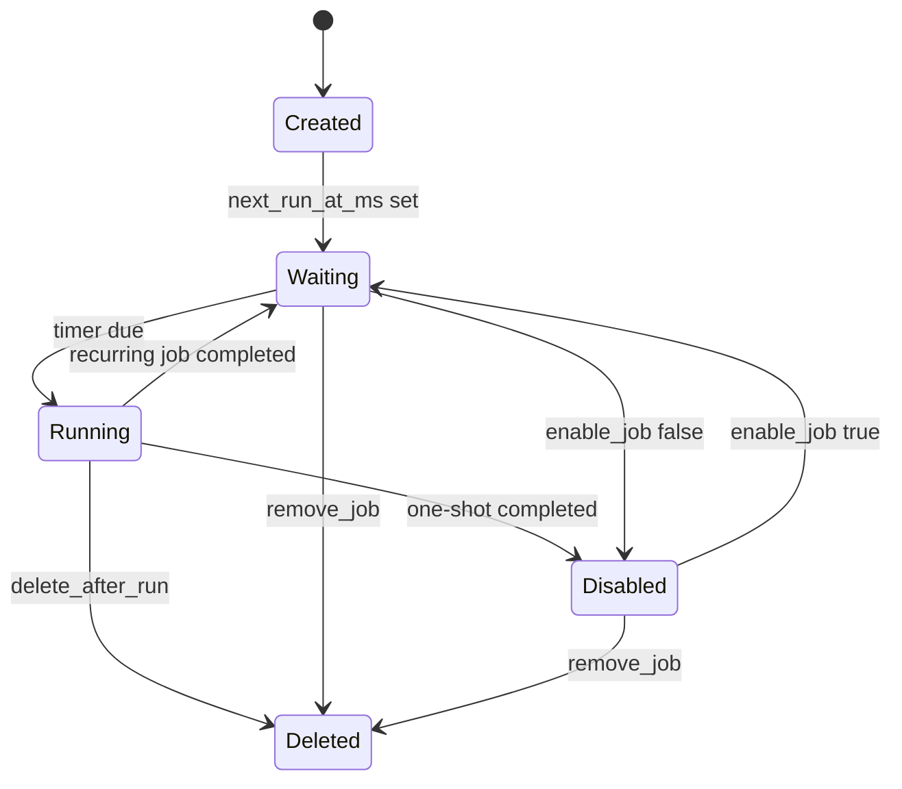

# `nanobot_learn/cron` 学习笔记

## 1. 相关 Python 点

### 1.1 `dataclass` 适合表达内部数据结构

- `CronSchedule`、`CronPayload`、`CronJobState`、`CronJob` 都是 `@dataclass`。
- 它们更像 TypeScript 里的 interface/type 加一点构造函数能力。
- `dataclass` 默认不做运行时类型校验，外部输入转换要靠 `_load_jobs()` 或 `CronJob.from_dict()`。

### 1.2 `Literal` 用来收窄字符串取值

例子：

```python
kind: Literal["at", "every", "cron"]
```

影响：

- IDE 和类型检查器知道 `kind` 只能是这三个值。
- 代码里可以用 `if schedule.kind == "cron"` 分支表达不同调度策略。

### 1.3 `Awaitable` 表示可以被 `await` 的回调

例子：

```python
on_job: Callable[[CronJob], Awaitable[str | None]] | None
```

影响：

- `CronService` 不直接知道 job 怎么执行，只负责在时间到了之后调用 `await self.on_job(job)`。
- 类比 TS：`onJob: (job: CronJob) => Promise<string | null>`。

### 1.4 `...` 是 sentinel，表示参数没有传

例子：

```python
channel: str | None | ellipsis = ...

if channel is not ...:
  job.payload.channel = channel
```

影响：

- 不传 `channel`：保持不变。
- 传 `channel=None`：明确清空。
- 如果默认值直接用 `None`，就没法区分“没传”和“传了 None”。

### 1.5 `raise ... from None` 用来隐藏底层异常链

例子：

```python
raise ValueError(f"unknown timezone '{schedule.tz}'") from None
```

影响：

- 调用方只看到业务错误 `unknown timezone 'Bad/Zone'`。
- 不会暴露 `ZoneInfo` 内部的 `ZoneInfoNotFoundError` 异常链。

## 2. 这个模块做什么

- `types.py` 定义 cron job 的数据结构。
- `service.py` 负责 job 的增删改查、持久化、计算下一次触发时间、定时执行。
- 它支持一个运行中的主服务实例，也支持其他临时实例通过 `action.jsonl` 写入增量操作。

### 2.1 模块结构图



## 3. 路径

### 3.1 当前路径

```text
nanobot_learn/cron/types.py
nanobot_learn/cron/service.py
tests/cron/test_cron_service.py
docs/2026-04-27_cron.md
```

### 3.2 运行时存储路径

假设：

```python
store_path = Path("/tmp/nanobot/cron/jobs.json")
```

那么：

```text
/tmp/nanobot/cron/jobs.json      # 完整 store 快照
/tmp/nanobot/cron/action.jsonl   # 增量操作日志
/tmp/nanobot/cron.lock           # 目录级 lock 文件
```

注意当前 lock 路径是：

```python
FileLock(str(store_path.parent) + ".lock")
```

所以它不是 `/tmp/nanobot/cron/.lock`，而是 `/tmp/nanobot/cron.lock`。

## 4. 协议 / 存储格式

### 4.1 `jobs.json`

`jobs.json` 是完整状态快照，字段偏向外部协议风格，使用 camelCase。

```json
{
  "version": 1,
  "jobs": [
    {
      "id": "abc123",
      "name": "daily report",
      "enabled": true,
      "schedule": {
        "kind": "cron",
        "atMs": null,
        "everyMs": null,
        "expr": "0 9 * * *",
        "tz": "Asia/Shanghai"
      },
      "payload": {
        "kind": "agent_turn",
        "message": "生成日报",
        "deliver": false,
        "channel": null,
        "to": null,
        "channelMeta": {},
        "sessionKey": null
      },
      "state": {
        "nextRunAtMs": 1777242000000,
        "lastRunAtMs": null,
        "lastStatus": null,
        "lastError": null,
        "runHistory": []
      },
      "createdAtMs": 1777200000000,
      "updatedAtMs": 1777200000000,
      "deleteAfterRun": false
    }
  ]
}
```

### 4.2 `action.jsonl`

`action.jsonl` 是增量操作日志，一行一个 JSON。

```json
{"action":"add","params":{"id":"abc123","name":"daily report","enabled":true}}
{"action":"update","params":{"id":"abc123","name":"new name","enabled":true}}
{"action":"del","params":{"job_id":"abc123"}}
```

当前 `action.jsonl` 的 `params` 来自 `asdict(job)`，所以内部字段是 snake_case，例如：

```json
{
  "state": {
    "next_run_at_ms": 1777242000000,
    "run_history": []
  }
}
```

因此需要 `CronJob.from_dict()` 负责把普通 dict 转回 dataclass。

### 4.3 数据流图



## 5. 关键概念

### 5.1 `self._running` 不是全局主服务锁

例子：

```python
if self._running:
  self._save_store()
  self._arm_timer()
else:
  self._append_action("update", asdict(job))
```

影响：

- `self._running=True` 表示当前这个 Python 对象正在驱动 timer。
- `self._running=False` 表示当前实例只记录操作到 `action.jsonl`。
- 它不是跨进程、跨实例的全局状态；两个 `CronService` 都可以各自 `start()`。

### 5.2 `action.jsonl` 是为了避免临时实例覆盖主服务状态

例子：

```text
主服务刚执行完 job，更新了 run_history
临时实例同时 add_job
如果临时实例直接重写 jobs.json，可能覆盖主服务刚写的 run_history
```

影响：

- 非运行实例只写增量操作，不直接改完整 store。
- 运行中的主服务拿自己的最新内存状态合并 action。
- 这类似后端 mutation log，而不是客户端直接覆盖数据库整表。

### 5.3 只能有一个真正的主服务实例

例子：

```python
service1 = CronService(store_path)
service2 = CronService(store_path)

await service1.start()
await service2.start()
```

影响：

- 两个实例都会认为自己是主服务。
- 同一个 job 可能被执行两次。
- 当前 `FileLock` 不是 leader lock，只保护 action 文件读写。
- 这个设计真实假设是：同一个 `store_path` 只有一个运行中的调度器。

### 5.4 `_timer_active` 防止执行中被 reload 回滚

例子：

```python
if self._timer_active and self._store:
  return self._store
```

影响：

- `_on_timer()` 正在执行 job 时，可能有别的代码调用 `list_jobs()`。
- `list_jobs()` 会调用 `_load_store()`。
- 如果此时从磁盘重新加载旧 store，可能覆盖正在更新的 `next_run_at_ms` 和 `run_history`。

### 5.5 三种 schedule 的下一次执行时间

例子：

```python
CronSchedule(kind="at", at_ms=1777242000000)
CronSchedule(kind="every", every_ms=60_000)
CronSchedule(kind="cron", expr="0 9 * * *", tz="Asia/Shanghai")
```

影响：

- `at`：只执行一次，过期则返回 `None`。
- `every`：从当前时间往后加间隔。
- `cron`：用 `croniter` 计算下一次命中时间，可以配合 `ZoneInfo` 指定时区。

## 6. 基本流程图

### 6.1 添加 job



### 6.2 启动主服务并合并 action



### 6.3 定时执行



### 6.4 状态变化图



## 7. 和 nanobot 本体的同步点

这一轮对齐了三个地方：

1. `payload.channelMeta` 必须写成正确拼写，避免 `channel_meta` 重载后丢失。
2. `status()` 返回 `enabled`，不是 `enable`。
3. `status()["jobs"]` 返回 job 数量，不返回 job 列表。
4. 时区错误要返回 `unknown timezone 'Bad/Zone'` 这种可读信息。

对应测试：

```text
tests/cron/test_cron_service.py
```

## 8. 这一轮先记住什么

1. `jobs.json` 是完整状态快照，`action.jsonl` 是增量操作日志。
2. `self._running=False` 时写 action，是为了让非主实例不要覆盖主服务内存里的最新状态。
3. 当前代码没有 leader election，所以同一个 `store_path` 只能有一个真正运行中的 cron 主服务。
4. `CronJob` 这类内部数据结构用 `dataclass` 足够；外部 JSON 到内部对象的转换要显式处理。
5. TDD 这轮补的测试锁住了 `channelMeta`、`status()` 协议和 timezone 错误信息。
