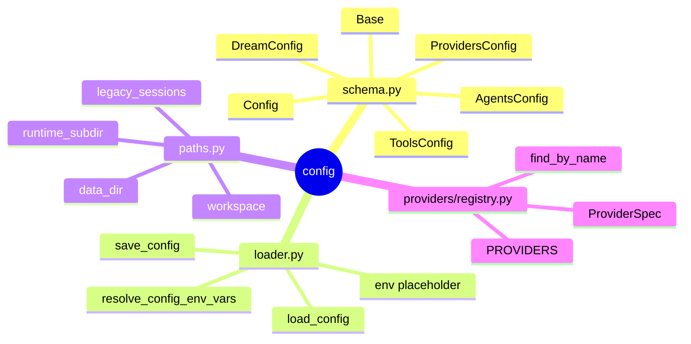
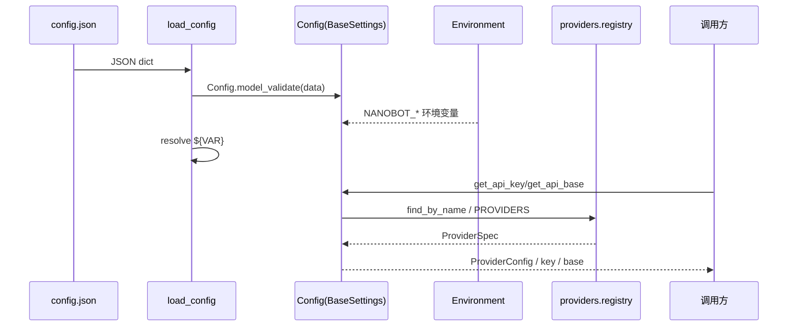
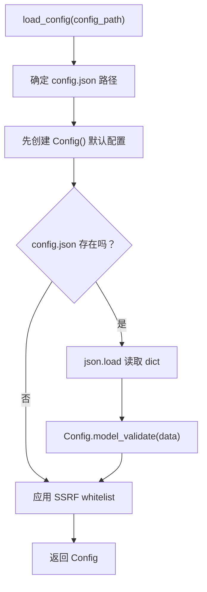
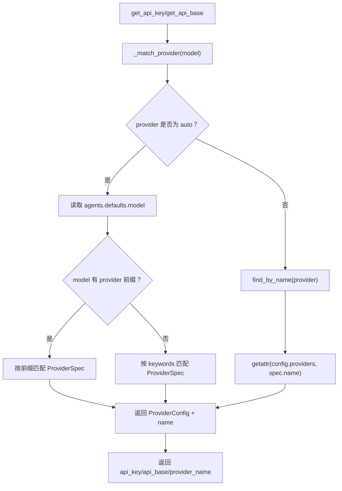
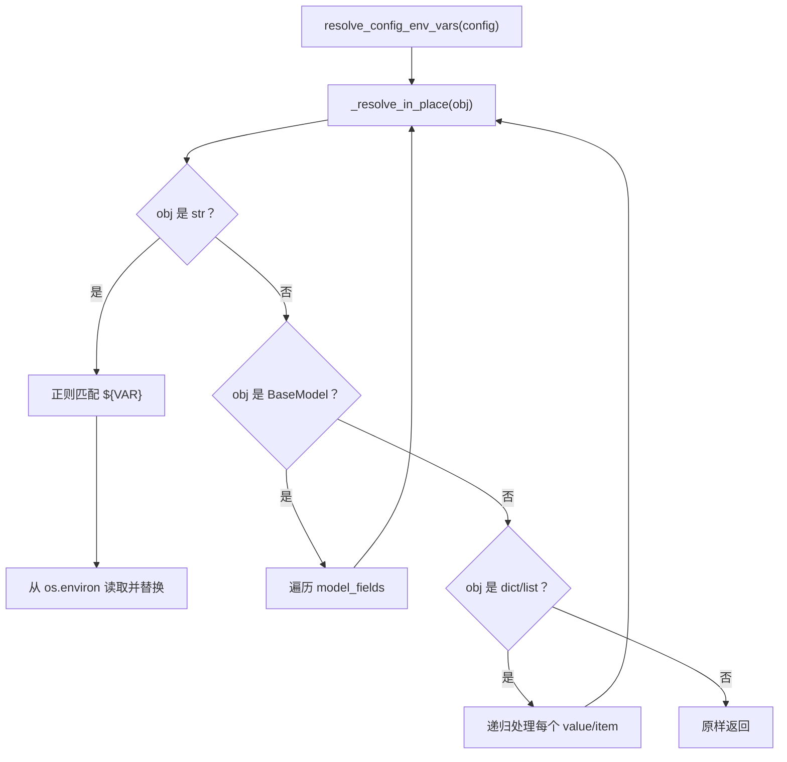

# `config` 学习笔记

## 1. 相关 Python 点

### 1.1 Pydantic `BaseModel`

- `BaseModel` 用类型标注定义数据结构，并在运行时校验输入。
- 类比 TS 里的 Zod schema：`Config.model_validate(data)` 类似 `ConfigSchema.parse(data)`。
- `model_dump(by_alias=True)` 可以把内部 snake_case 字段按外部 camelCase alias 导出。

### 1.2 `BaseSettings` 和 `SettingsConfigDict`

- `BaseSettings` 是 Pydantic Settings 的配置模型基类，额外支持从环境变量读取字段。
- `SettingsConfigDict(env_prefix="NANOBOT_", env_nested_delimiter="__")` 表示只读取 `NANOBOT_` 前缀，并用 `__` 表示嵌套路径。
- 例子：`NANOBOT_AGENTS__DEFAULTS__MODEL` 会映射到 `config.agents.defaults.model`。

### 1.3 `Field` alias

- `validation_alias` 控制输入字段名，例如 `modelOverride`、`model`、`model_override` 都可以映射到内部 `model_override`。
- `serialization_alias` 控制输出字段名，例如 `session_ttl_minutes` 导出为 `idleCompactAfterMinutes`。
- `alias_generator=to_camel` 给普通字段自动生成 camelCase 外部名称。

### 1.4 `Path.expanduser()` 和 `resolve(strict=False)`

- `expanduser()` 把 `~/.nanobot/workspace` 展开成真实 home 路径。
- `resolve(strict=False)` 规范化路径，但不要求路径已经存在。
- 这让 `~/.nanobot/../.nanobot/workspace` 和 `~/.nanobot/workspace` 能被判断为同一个路径。

## 2. 这个模块做什么

- `config/schema.py` 定义 nanobot 配置的数据结构、默认值、校验规则和 provider 解析入口。
- `config/loader.py` 负责从 `config.json` 加载/保存配置，并解析 `${ENV_VAR}` 占位符。
- `config/paths.py` 根据当前配置路径推导运行时目录。
- `providers/registry.py` 是 provider 元数据的单一来源，`Config` 只消费它，不再内联 provider 列表。

### 2.1 模块结构图



## 3. 路径

### 3.1 当前路径

```text
nanobot_learn/config/schema.py
nanobot_learn/config/loader.py
nanobot_learn/config/paths.py
nanobot_learn/providers/registry.py
tests/config/test_schema.py
tests/config/test_loader.py
```

### 3.2 默认运行时路径

```text
~/.nanobot/config.json
~/.nanobot/workspace
~/.nanobot/media
~/.nanobot/cron
~/.nanobot/logs
~/.nanobot/history/cli_history
~/.nanobot/sessions
```

## 4. 配置格式

最小配置可以只覆盖需要改的字段，其他字段走默认值。

```json
{
  "agents": {
    "defaults": {
      "model": "openai/gpt-4.1",
      "provider": "auto",
      "idleCompactAfterMinutes": 15,
      "consolidationRatio": 0.5
    }
  },
  "providers": {
    "openai": {
      "apiKey": "${OPENAI_API_KEY}"
    }
  },
  "tools": {
    "restrictToWorkspace": true
  }
}
```

### 4.1 数据流图



## 5. 关键概念

### 5.1 内部字段名和外部字段名

例子：

```python
class DreamConfig(Base):
    model_override: str | None = Field(
        default=None,
        validation_alias=AliasChoices("modelOverride", "model", "model_override"),
    )
```

影响：

- Python 内部统一使用 `config.agents.defaults.dream.model_override`。
- 外部 JSON 可以传 `modelOverride`、`model` 或 `model_override`。
- 字段名由等号左边决定，不由 `AliasChoices` 的顺序决定。

### 5.2 `Config` 是根配置对象

例子：

```python
config = Config.model_validate({
    "agents": {"defaults": {"model": "openai/gpt-4.1"}},
    "providers": {"openai": {"apiKey": "sk-test"}},
})

config.agents.defaults.model
config.providers.openai.api_key
```

影响：

- `Config` 把配置拆成几个子配置：`agents`、`channels`、`providers`、`api`、`gateway`、`tools`。
- 业务代码不直接处理原始 dict，而是访问强类型对象。

### 5.3 `BaseSettings` 环境变量读取

例子：

```bash
export NANOBOT_AGENTS__DEFAULTS__MODEL="openai/gpt-4.1"
export NANOBOT_PROVIDERS__OPENAI__API_KEY="sk-test"
```

```python
config = Config()
config.agents.defaults.model
config.providers.openai.api_key
```

影响：

- 环境变量可以覆盖配置字段，适合部署时注入 secret 或环境差异。
- `__` 表示进入下一层对象，类似把扁平 key 转成嵌套对象。

### 5.4 `${ENV_VAR}` 占位符解析

例子：

```json
{
  "providers": {
    "openai": {
      "apiKey": "${OPENAI_API_KEY}"
    }
  }
}
```

影响：

- `resolve_config_env_vars(config)` 会把字符串里的 `${OPENAI_API_KEY}` 替换成真实环境变量。
- 这个逻辑需要递归处理 `BaseModel`、`dict`、`list` 和 extra 字段。
- 注意：当前学习工程的 `_resolve_in_place()` 里，BaseModel 字段递归处要对齐上游，应递归字段值而不是整个对象。

### 5.5 Provider registry

例子：

```python
from nanobot_learn.providers.registry import find_by_name

spec = find_by_name("openrouter")
spec.default_api_base
```

影响：

- provider 元数据现在放在 `providers/registry.py`，而不是 `config/schema.py`。
- `Config._match_provider()` 只负责消费 registry，避免 config schema 承担 provider 元数据维护职责。
- 后续学习 provider factory、status、env 注入时，都可以复用同一个 registry。

### 5.6 Provider 自动解析

例子：

```python
config = Config.model_validate({
    "agents": {"defaults": {"provider": "auto", "model": "openai/gpt-4.1"}},
    "providers": {"openai": {"apiKey": "sk-test"}},
})

config.get_provider_name()  # "openai"
config.get_api_key()        # "sk-test"
```

影响：

- 如果 `provider != "auto"`，直接按显式 provider 找配置。
- 如果 `provider == "auto"`，按 model 前缀或关键词推断 provider。
- 调用方只问 `get_api_key()` / `get_api_base()`，不需要到处写 `if model.startswith(...)`。

## 6. 基本流程图

### 6.1 加载配置



### 6.2 Provider 解析



### 6.3 `${ENV_VAR}` 解析



## 7. 和上游 nanobot 的当前差异

1. `providers/registry.py` 已经拆到正确位置，但学习版 registry 仍是精简复制；上游 `ProviderSpec` 字段和 provider 列表更完整。
2. `loader.py` 还缺上游的 `_migrate_config()`，暂时不支持旧配置字段迁移。
3. `loader.py` 还缺上游的 `_resolve_env_vars()` plain object helper。
4. `loader.py` 当前 `_resolve_in_place()` 的 BaseModel 分支存在递归对象写错的问题，需要后续修复并补测试。
5. `paths.py` 行为基本对齐，主要差异是学习注释和格式。

## 8. 这一轮先记住什么

1. `schema.py` 定义配置结构，`loader.py` 负责加载和环境变量占位符解析，`paths.py` 负责运行时路径。
2. `BaseSettings` 读取 `NANOBOT_*` 环境变量；`${VAR}` 是另外一套由 `loader.py` 做的字符串替换机制。
3. Provider registry 应该属于 `providers` 模块，`Config` 只负责根据 `provider/model` 找到对应 provider 配置。
4. `model_validate()` 是 Pydantic v2 的模型校验入口，不是 `BaseSettings` 独有能力。
5. 配置模块的关键收益是把松散 JSON/env 转成可校验、可补默认值、可推断 provider 的强类型对象。
