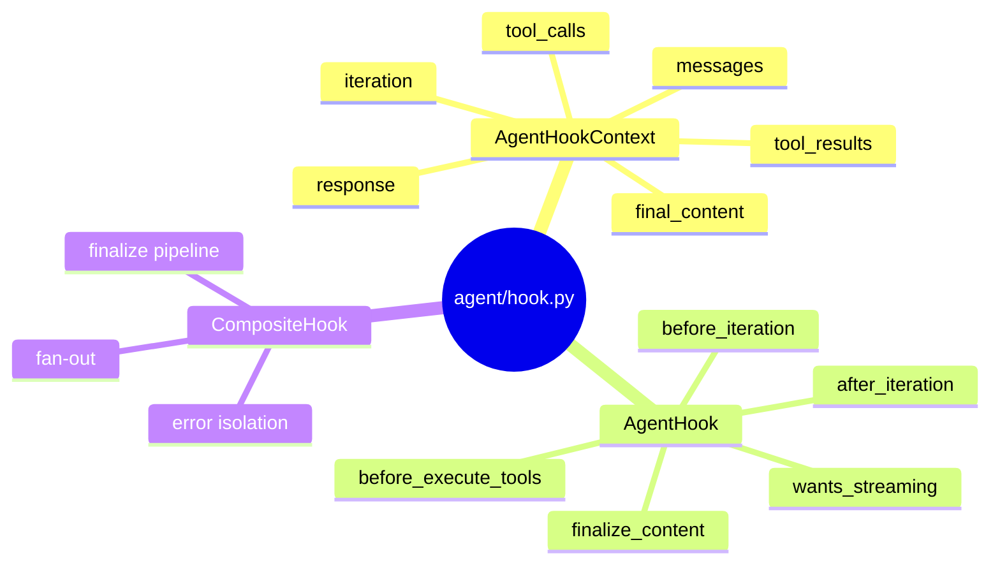
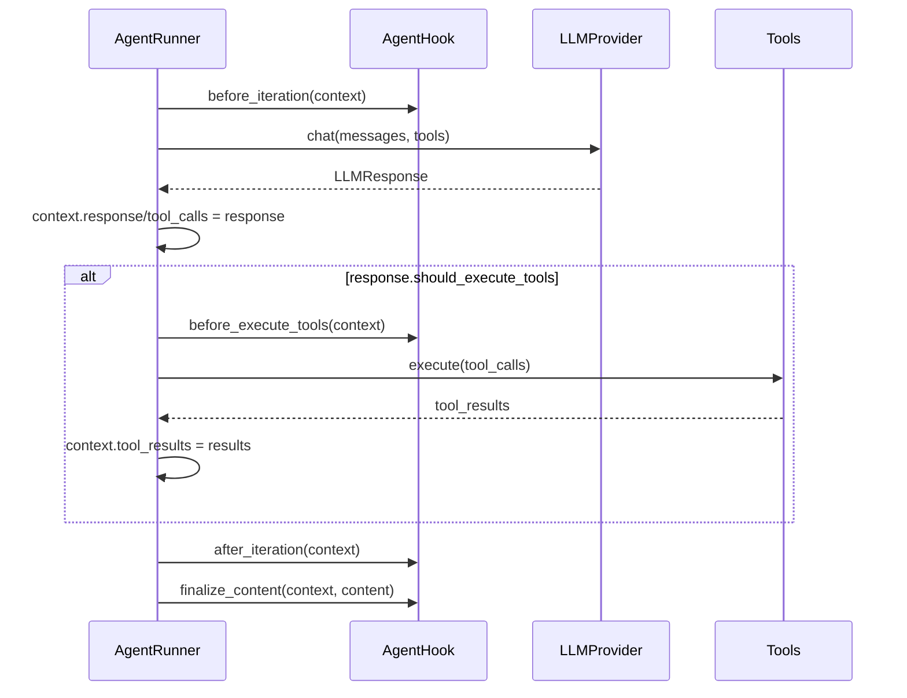
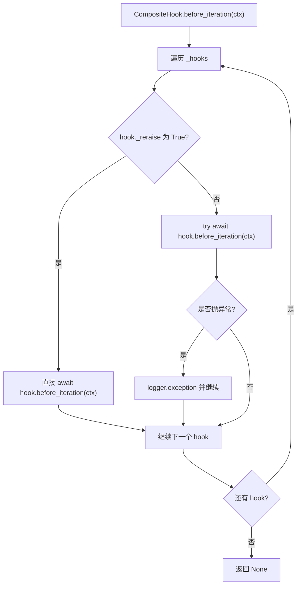
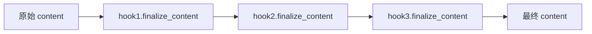

# `agent/hook.py` 学习笔记

## 1. 相关 Python 点

### 1.1 `@dataclass(slots=True)`

- `dataclass` 根据类型标注自动生成 `__init__`、`repr` 等方法。
- `slots=True` 让实例字段固定，不能随便加未声明字段，适合表达稳定的 context 结构。
- 字段必须有类型标注才会被 dataclass 识别，例如 `streamed_content: bool = False`。

### 1.2 `field(default_factory=...)`

- 列表和 dict 这类 mutable 默认值不能直接写成 `[]` 或 `{}`。
- `field(default_factory=list)` 会让每个实例拿到自己的新列表。
- 类比 TS 里不要把共享 mutable 对象放到原型或模块级默认值里。

### 1.3 `from __future__ import annotations`

- 让类型注解延迟求值，先按字符串保存，减少类之间互相引用时的导入问题。
- 对支持 Python 3.11 的库代码比较常见，尤其是类型标注较多的模块。
- 它不影响 dataclass 是否识别字段，dataclass 仍然依赖字段左侧有没有类型标注。

### 1.4 no-op base class

- `AgentHook` 没写成 ABC，因为 hook 方法都是可选覆写。
- 基类提供默认空行为，用户只需要实现自己关心的生命周期方法。
- `AgentHook()` 本身就是一个合法的空 hook，方便组合和测试。

## 2. 这个模块做什么

- `AgentHookContext` 是 runner 每轮迭代暴露给 hook 的可变上下文。
- `AgentHook` 定义 agent 生命周期的稳定扩展面。
- `CompositeHook` 把多个 hook 组合成一个 hook，让 runner 只面对单个对象。

### 2.1 模块结构图



## 3. 路径

### 3.1 当前路径

```text
nanobot_learn/agent/hook.py
nanobot_learn/agent/__init__.py
tests/agent/test_hook.py
```

### 3.2 上游参考路径

```text
nanobot/agent/hook.py
nanobot/agent/runner.py
nanobot/agent/loop.py
```

## 4. Hook 协议

hook 对象需要提供一组生命周期方法。调用方可以继承 `AgentHook`，只覆写其中一部分。

```python
class AuditHook(AgentHook):
    async def before_execute_tools(self, context: AgentHookContext) -> None:
        for tool_call in context.tool_calls:
            print(tool_call.name)
```

### 4.1 数据流图



## 5. 关键概念

### 5.1 `AgentHookContext` 是每轮迭代的状态包

例子：

```python
context = AgentHookContext(iteration=0, messages=[])
context.response = response
context.tool_calls = list(response.tool_calls)
context.tool_results = results
```

影响：

- hook 读取 context 来观测 runner 状态，例如工具调用、token usage、停止原因。
- runner 会在不同阶段逐步填充 context，所以 `response` 默认必须是 `None`。
- `streamed_content` 必须是 dataclass 字段，否则 `slots=True` 下后续赋值会失败。

### 5.2 `AgentHook` 是可选覆写的生命周期表面

例子：

```python
class TimingHook(AgentHook):
    async def before_iteration(self, context: AgentHookContext) -> None:
        self.started_at = time.perf_counter()
```

影响：

- 用户不需要实现所有方法，只实现需要的那一个。
- runner 可以统一调用完整方法面，不需要每次 `hasattr` 判断。
- 这就是它不适合写成带 `@abstractmethod` 的 ABC 的主要原因。

### 5.3 `CompositeHook` 是组合器

例子：

```python
hook = CompositeHook([loop_hook, AuditHook(), MetricsHook()])
await hook.before_iteration(context)
```

影响：

- `before_iteration`、`before_execute_tools` 等 async 方法会按顺序广播给每个 hook。
- 默认会隔离单个 hook 的异常，记录日志后继续调用后面的 hook。
- 如果某个 hook 设置 `reraise=True`，它的异常会向外抛出。

### 5.4 `finalize_content` 是 pipeline

例子：

```python
content = hook1.finalize_content(context, content)
content = hook2.finalize_content(context, content)
```

影响：

- 前一个 hook 的返回值会成为后一个 hook 的输入。
- 它不是单纯的广播，因为最终内容需要一个确定的转换结果。
- 这个方法不做错误隔离，内容转换失败应该暴露出来。

## 6. 基本流程图

### 6.1 CompositeHook fan-out



### 6.2 finalize pipeline



## 7. 这一轮先记住什么

1. `AgentHook` 是 no-op base class，不是强制实现的抽象类。
2. `CompositeHook` 把多个 hook 包装成一个 hook，async 生命周期方法是 fan-out。
3. `finalize_content` 是 pipeline，返回值会一路传下去。
4. `dataclass(slots=True)` 下，字段必须有类型标注，否则后续赋值可能失败。
