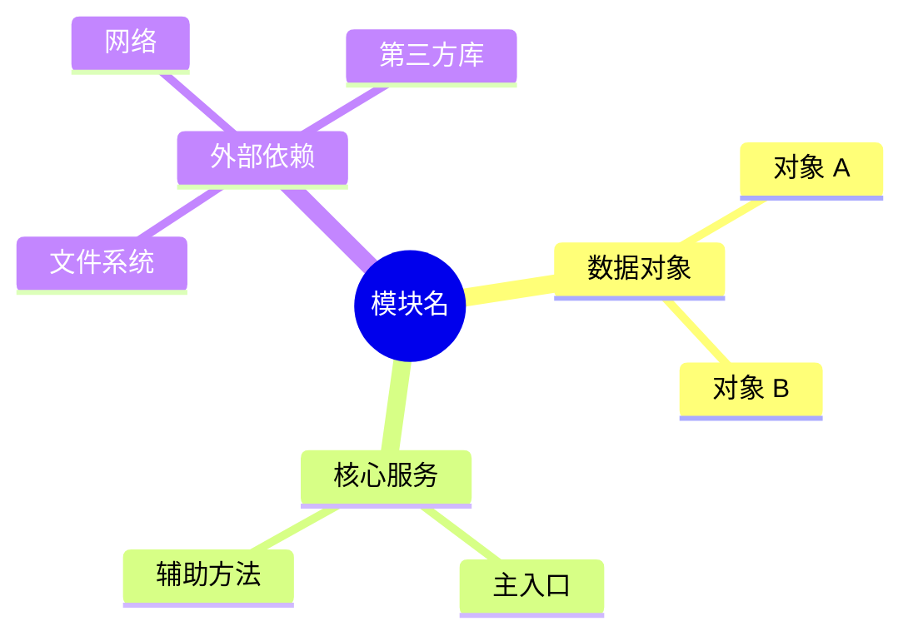
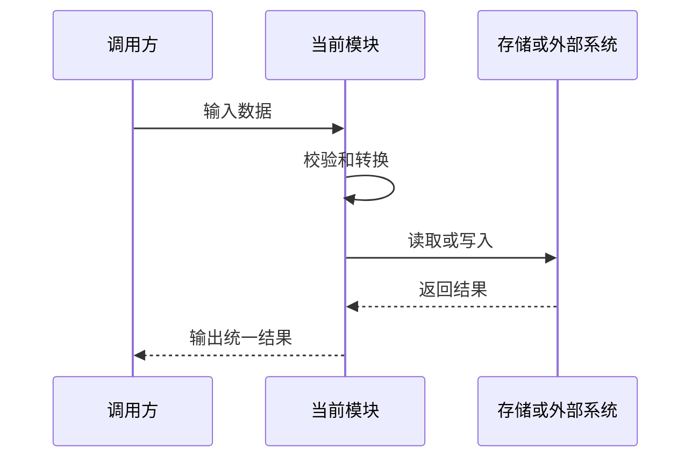
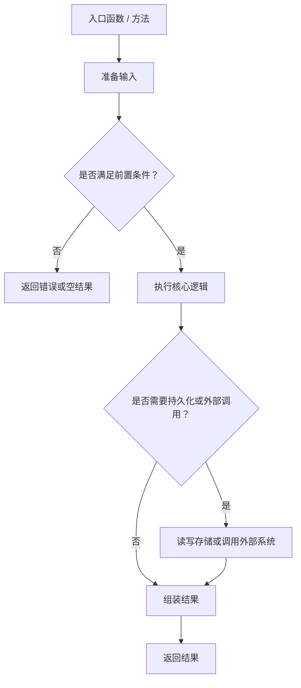
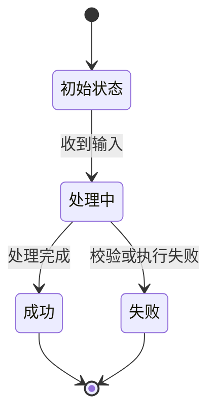

# `{{module/path.py}}` 学习笔记

## 1. 相关 Python 点

### 1.1 {{问题 1}}

- {{用 1-3 条记录这个点}}

### 1.2 {{问题 2}}

- {{用 1-3 条记录这个点}}

## 2. 这个模块做什么

- {{一句话说明模块职责}}
- {{如果有两层职责，也只写到 2-3 条}}

### 2.1 模块结构图



## 3. 路径

### 3.1 当前路径

```text
{{当前模块相关的关键路径}}
```

### 3.2 兼容 / legacy 路径

```text
{{如果没有可以删掉这一节}}
```

## 4. 协议 / 存储格式

- {{例如：JSONL / dict 结构 / role 类型}}

```json
{{放最小样例}}
```

### 4.1 协议 / 数据流图



## 5. 关键概念

> 写作要求：每个关键概念都要先给一个最小例子，再说明它影响了什么。不要只写定义。

### 5.1 {{概念 1}}

例子：

```python
{{放一个最小代码 / dict / 输入输出样例}}
```

影响：

- {{说明它影响哪个函数 / 流程 / 存储格式 / 外部协议}}
- {{说明如果理解错或实现错，会出现什么问题}}

### 5.2 {{概念 2}}

例子：

```text
{{放一个最小场景，例如：输入 -> 处理 -> 输出}}
```

影响：

- {{说明它影响哪个边界：调用方、provider、文件、网络、测试等}}
- {{说明这个概念为什么需要单独记住}}

## 6. 基本流程图

### 6.1 {{主流程}}



### 6.2 状态变化图



## 7. 这一轮先记住什么

1. {{最重要的点 1}}
2. {{最重要的点 2}}
3. {{最重要的点 3}}
